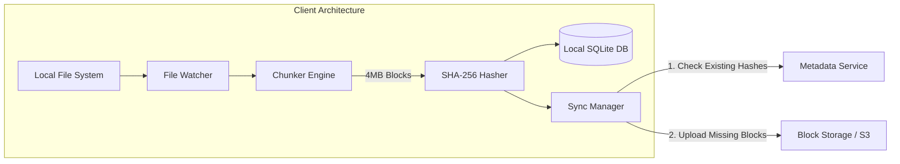
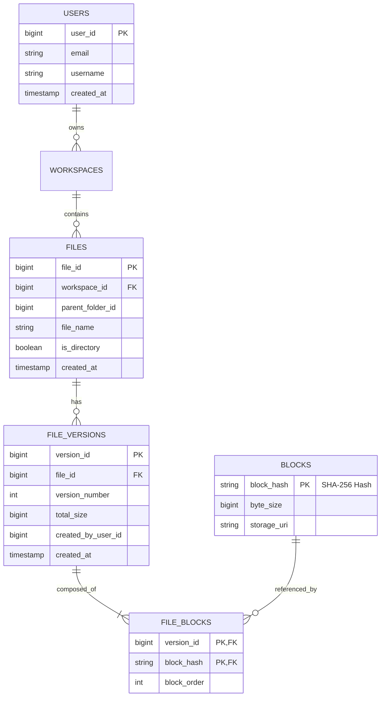
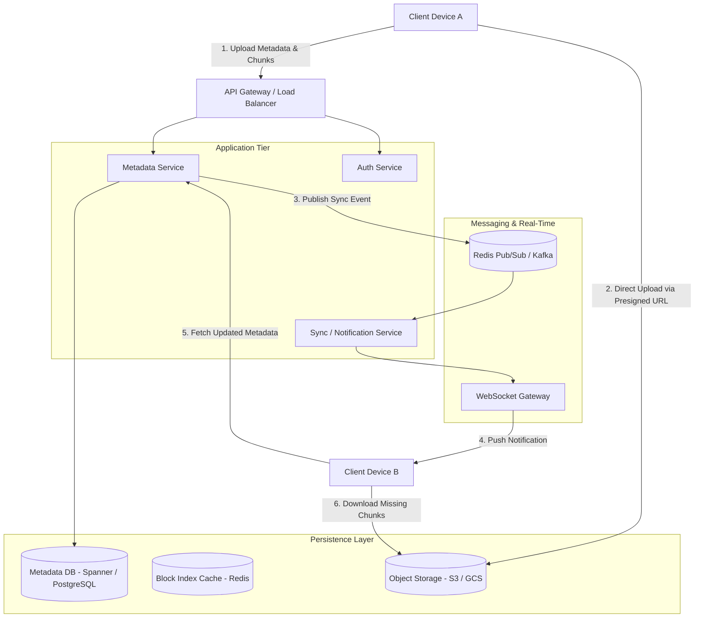
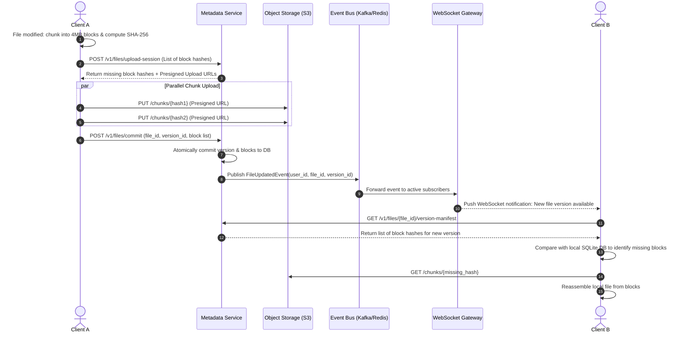

# Google Drive / Dropbox System Design

A comprehensive system design documentation for a cloud file storage and file synchronization platform (such as Google Drive, Dropbox, or OneDrive), covering requirements, capacity estimations, data modeling, block-level chunking, notification mechanics, and end-to-end synchronization workflows.

---

## 1. Requirements

### 1.1 Functional Requirements
1. **File Upload & Download:** Users can upload, download, and delete files of varying sizes (from small text files to large multi-gigabyte media files).
2. **File Synchronization:** Changes made to a file locally on one device (desktop/mobile/web) must automatically synchronize across all user devices.
3. **Bandwidth Optimization (Chunking / Delta Sync):** Only modified chunks (deltas) of a file should be re-uploaded/downloaded rather than re-transmitting the entire file.
4. **File Versioning & History:** Maintain a history of file edits to support rollback and revision restoration.
5. **File & Folder Sharing:** Users can share files or folders with others with read/write permission levels.

### 1.2 Non-Functional Requirements
1. **High Durability (11 9s):** Uploaded user data must never be lost or corrupted ($99.999999999\%$ durability).
2. **Strong Consistency for Metadata:** File metadata (directory trees, chunk orders, versions) must be strongly consistent so users never view stale file state across devices.
3. **Low Latency & High Throughput:** Chunk uploads and downloads must utilize network bandwidth efficiently via concurrent, chunked data streams.
4. **Offline Support:** Local edits while offline should queue and automatically synchronize once internet connectivity is restored.

---

## 2. Scale & Capacity Estimations

Let us assume standard cloud storage production scale metrics:

* **Daily Active Users (DAU):** $100\text{ million}$
* **Average File Operations per User/Day:** $2\text{ uploads/syncs}$ per active user
* **Total Daily Uploads:** $100\text{M} \times 2 = 200\text{ million}$ file operations/day
* **Read-to-Write Ratio:** $1:1$ for personal sync (each write synchronizes to roughly 1-2 secondary devices)
* **Average File Size:** $500\text{ KB}$ (factoring in documents, photos, and delta updates)

### 2.1 Throughput Calculations
* **Write/Upload QPS:**
  $$\text{Write QPS} = \frac{200{,}000{,}000 \text{ operations}}{86{,}400 \text{ seconds}} \approx 2{,}315 \text{ requests/sec}$$
  $$\text{Peak Write QPS} \approx 2 \times 2{,}315 \approx 4{,}630 \text{ requests/sec}$$
* **Network Bandwidth (Ingress):**
  $$\text{Ingress Bandwidth} = 2{,}315 \text{ ops/sec} \times 500\text{ KB} \approx 1.16\text{ GB/sec} \approx 9.28\text{ Gbps}$$

### 2.2 Storage Estimations
* **Daily Raw File Storage:**
  $$200\text{ million ops} \times 500\text{ KB} = 100\text{ TB/day}$$
* **5-Year Storage Requirement:**
  $$100\text{ TB/day} \times 365 \times 5 \approx 182.5\text{ PB}$$
* **Deduplication Savings:** Content-addressable block storage saves approximately $30\text{--}40\%$ of disk capacity across users.

---

## 3. Core Architecture: Block-Level Chunking & Client Architecture

Uploading an entire $2\text{ GB}$ file for a single byte edit is unacceptable. Dropbox/Google Drive split files into discrete blocks.



### 3.1 Client Components
1. **File Watcher:** OS-level listener (`inotify` on Linux, `FSEvents` on macOS, `ReadDirectoryChangesW` on Windows) tracking create, modify, move, and delete events in the sync directory.
2. **Chunker Engine:** Splits large files into smaller segments (typically fixed-size $4\text{ MB}$ chunks or dynamic Content-Defined Chunking via Rabin Fingerprints).
3. **Hasher & Local Index DB:** Computes SHA-256 checksums for each chunk. The local SQLite database tracks file path, chunk order, hash list, and local timestamps.
4. **Sync Manager:** Manages multi-threaded uploads/downloads, handles backoff/retries, and communicates with cloud services.

---

## 4. Data Model & Database Schema

Metadata requires ACID compliance and strong consistency (PostgreSQL or Spanner). Raw chunk blobs are stored in Object Storage (e.g., AWS S3, Google Cloud Storage).



### 4.1 Block Deduplication
Because `BLOCKS` are keyed by their SHA-256 `block_hash`, identical chunks (even across different files or users) map to the exact same physical record in object storage.

---

## 5. End-to-End System Architecture



---

## 6. Detailed Workflows

### 6.1 File Upload & Sync Workflow



---

## 7. Deep Dives & Optimization

### 7.1 Conflict Resolution (Branching Revisions)
* **Problem:** Two devices edit the same file simultaneously while offline.
* **Mechanism:**
  * Optimistic Concurrency Control (OCC) using `version_number`.
  * The first client to commit increments the version from $V1 \to V2$.
  * The second client attempts to commit $V1 \to V2$, which fails because the parent version has changed.
  * The server resolves this without losing data by creating a **Conflicted Copy** (e.g., `Document (Client B's conflicted copy 2026-09-22).docx`), leaving the user to reconcile content differences.

### 7.2 Content-Defined Chunking (Rabin Fingerprints)
* **Fixed-size chunking flaw:** Inserting 1 character at the beginning of a file shifts all chunk boundaries, changing every single downstream SHA-256 hash.
* **Solution:** Use a sliding window hash (Rabin Fingerprints) to find boundary anchors based on content patterns (e.g., whenever lowest 22 bits match a pattern). Insertions/deletions only affect the local chunk, leaving all subsequent chunk boundaries and hashes unchanged.

### 7.3 Efficient Notification Channel
* Maintain persistent **long-polling HTTP** or **WebSocket** connections through an edge connection fleet.
* Rather than sending the full payload over WebSockets (which consumes high memory), the notification payload is a lightweight signal:
  ```json
  {
    "event": "FILE_MODIFIED",
    "file_id": "981249823",
    "version": 4
  }
  ```
* The client then issues an HTTPS GET request to synchronize metadata and fetch required chunks over parallel HTTP/2 streams.