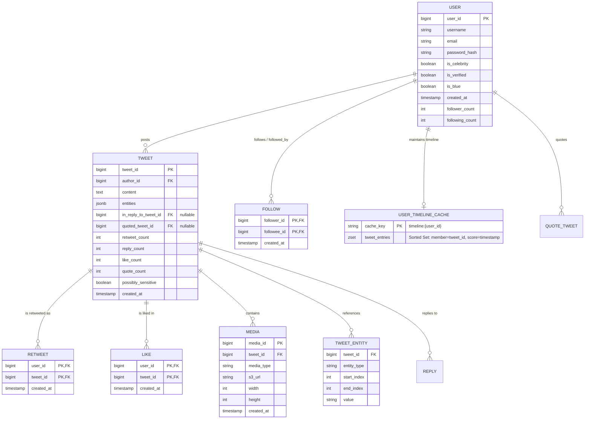
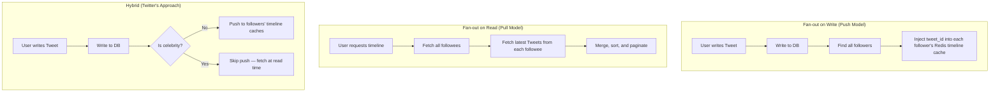
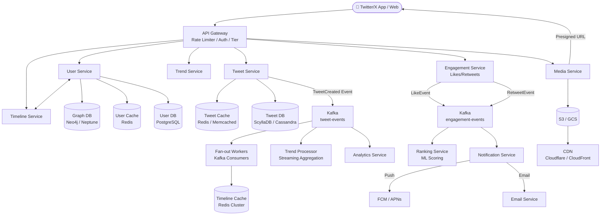
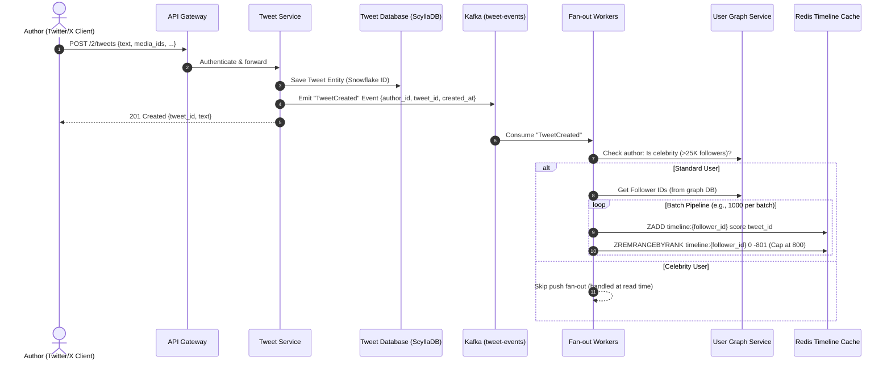
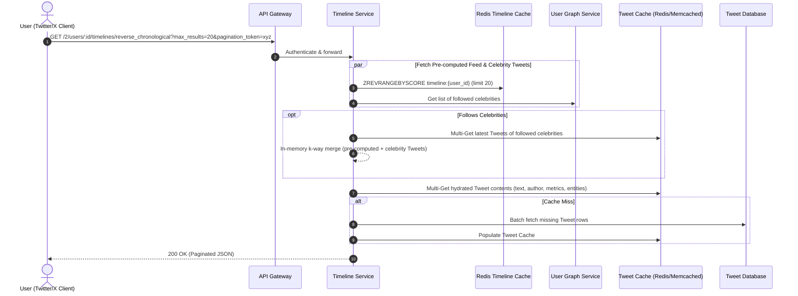
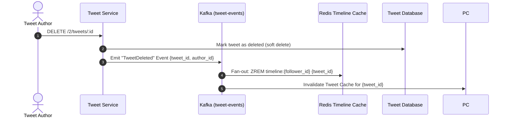

# Twitter / X — News Feed (Timeline) System Design

## 1. Overview & Problem Statement

The **Twitter / X Home Timeline** is a real-time social feed that aggregates and serves a constantly updating stream of **Tweets** (text, images, videos, polls, threads) published by accounts a user follows. With hundreds of millions of Daily Active Users (DAU), tweets traveling at viral speed, and a mix of ordinary users and global celebrities with tens of millions of followers, the Home Timeline is one of the most challenging distributed systems in the world.

This document outlines an end-to-end distributed system design for a large-scale Twitter-like News Feed, detailing functional/non-functional requirements, scale estimations, API specifications, data models, architectural patterns (Fan-out on Read vs. Write vs. Hybrid), and deep dives into Twitter-specific edge cases like the **celebrity problem**, real-time trending, and tweet deletion/censorship.

> **Note:** Terminology follows Twitter/X conventions — **Tweet**, **Timeline**, **Follower Graph**, **Retweet**, **Like**, **Thread**, etc.

---

## 2. Requirements

### 2.1 Functional Requirements
- **Tweet Creation:** Users can publish new Tweets (text up to 280 characters, images, GIFs, videos, polls, threads, quote Tweets).
- **Home Timeline Retrieval:** Users can view a paginated reverse-chronological (or algorithmic "For You") timeline of Tweets from accounts they follow.
- **Real-Time Delivery:** Tweets from followed accounts should appear in followers' timelines within seconds.
- **Retweet & Quote Tweet:** Users can amplify Tweets from others onto their own timeline.
- **Like / Unlike:** Users can mark Tweets as liked (affects ranking signal).
- **Social Graph Management:** Users can follow/unfollow accounts; graph changes propagate to feed generation.
- **Tweet Deletion / Visibility:** Users can delete their own Tweets; Tweets can be withheld (e.g., legal/TOS) — timeline caches must reflect these changes.
- **Trend Detection:** System must identify and surface trending topics in real-time.

### 2.2 Non-Functional Requirements
- **Low Latency Feed Generation:** Fetching the Home Timeline should take $\le 200\text{ ms}$ at $p99$.
- **High Availability:** $99.99\%$ uptime. Eventual consistency is acceptable; a few seconds of delay in seeing a new Tweet is tolerable.
- **Scalability:** Hundreds of millions of DAU, tens of millions of Tweets/day, millions of concurrent reads/writes.
- **Read-Heavy System:** Asymmetric read-to-write ratio of approximately $100:1$ to $1000:1$.
- **Real-Time:** Trending topic detection and viral Tweet propagation require sub-second processing.

---

## 3. Capacity Estimation & Scale (Back-of-the-Envelope)

### 3.1 Assumptions & Metrics (Twitter-Scale)
- **Daily Active Users (DAU):** $300 \times 10^6$ ($300\text{M}$)
- **Tweets Created per day:** Assume $500 \times 10^6$ Tweets/day (heavier posting frequency than generic feeds; includes retweets, quote tweets).
- **Timeline Views per day:** Average user visits Home Timeline $10$ times/day $\implies 300\text{M} \times 10 = 3 \times 10^9$ timeline views/day.
- **Read-to-Write Ratio:** $3\text{B} : 500\text{M} = 6:1$ (but per-user it's much higher: $\sim 1000:1$ since one Tweet write fans out to many reads).

### 3.2 Throughput (TPS)
- **Write QPS (Tweet creation):**
  $$\text{Average Write QPS} = \frac{500 \times 10^6}{86{,}400} \approx 5{,}787 \text{ Tweets/second}$$
  $$\text{Peak Write QPS} \approx 5{,}787 \times 3 \approx 15{,}000 - 20{,}000 \text{ Tweets/second}$$

- **Read QPS (Timeline views):**
  $$\text{Average Read QPS} = \frac{3 \times 10^9}{86{,}400} \approx 34{,}722 \text{ queries/second}$$
  $$\text{Peak Read QPS} \approx 34{,}722 \times 3 \approx 100{,}000 \text{ QPS}$$

### 3.3 Storage Estimates (Per Day & 5 Years)
- **Average Tweet Size:**
  - `tweet_id`: $8\text{ bytes}$ (Snowflake ID)
  - `author_id`: $8\text{ bytes}$
  - `text`: $280\text{ chars} \times 2\text{ bytes} \approx 560\text{ bytes}$
  - `metadata` (timestamps, engagement counts, entities): $\approx 440\text{ bytes}$
  - **Total Text & Metadata:** $\approx 1\text{ KB}$ per Tweet.
- **Media (Images/GIFs/Videos):** Assume $30\%$ of Tweets contain media ($\approx 300\text{ KB}$ compressed average).
  - Blended media per Tweet: $0.30 \times 300\text{ KB} = 90\text{ KB}$.
- **Storage per day:**
  - Metadata: $500\text{M} \times 1\text{ KB} \approx 500\text{ GB/day}$
  - Media: $500\text{M} \times 90\text{ KB} \approx 45\text{ TB/day}$
- **5-Year Storage Requirement:**
  - Metadata: $500\text{ GB} \times 365 \times 5 \approx 912.5\text{ TB}$
  - Media: $45\text{ TB} \times 365 \times 5 \approx 82.1\text{ PB}$

### 3.4 Memory / Cache Estimates
- Caching top $800$ Tweet IDs per active user:
  - Size per reference: $8\text{ bytes (tweet\_id)} + 8\text{ bytes (timestamp/score)} = 16\text{ bytes}$.
  - Per user timeline cache: $800 \times 16\text{ bytes} \approx 12.8\text{ KB}$.
  - For $300\text{M}$ DAU:
    $$300 \times 10^6 \times 12.8\text{ KB} \approx 3.84\text{ TB of RAM}$$
  - A Redis cluster distributed across multiple nodes can comfortably hold this.

---

## 4. API Design

RESTful endpoints using JSON over HTTPS with Bearer token (OAuth 2.0) authentication, aligned with Twitter API conventions.

### 4.1 Create Tweet
```http
POST /2/tweets
Authorization: Bearer <OAuth2_TOKEN>
Content-Type: application/json

{
  "text": "Just shipped the new timeline architecture. 🚀",
  "media_ids": ["1428915073012346881"],
  "reply_settings": "everyone"
}
```
**Response:**
```json
{
  "data": {
    "id": "183920194820194816",
    "text": "Just shipped the new timeline architecture. 🚀",
    "edit_history_tweet_ids": ["183920194820194816"]
  }
}
```

### 4.2 Fetch Home Timeline (Cursor-Based Pagination)
```http
GET /2/users/:id/timelines/reverse_chronological?max_results=20&pagination_token=abc123
Authorization: Bearer <JWT_TOKEN>
```
**Response:**
```json
{
  "data": [
    {
      "id": "183920194820194816",
      "author_id": "2244994945",
      "text": "Excited to share our latest project update!",
      "created_at": "2026-09-20T11:58:30.000Z",
      "public_metrics": {
        "retweet_count": 142,
        "reply_count": 18,
        "like_count": 891,
        "quote_count": 23
      }
    }
  ],
  "meta": {
    "next_token": "b26v89c19zqg8o3fosdk9djia73",
    "result_count": 20
  }
}
```

### 4.3 Follow / Unfollow Account
```http
POST /2/users/:id/following
DELETE /2/users/:id/following
Authorization: Bearer <JWT_TOKEN>
```

### 4.4 Retweet / Unretweet
```http
POST /2/users/:id/retweets
DELETE /2/users/:id/retweets
Authorization: Bearer <JWT_TOKEN>
```

### 4.5 Like / Unlike
```http
POST /2/users/:id/likes
DELETE /2/users/:id/likes
Authorization: Bearer <JWT_TOKEN>
```

---

## 5. Data Model & Database Architecture



### Storage Selection:
1. **User & Follow Graph Service:**
   - Relational DB (PostgreSQL) sharded by `user_id` or a Graph Database (Neo4j / Amazon Neptune) for traversing follower edges.
2. **Tweet Storage:**
   - Wide-column NoSQL (Cassandra / ScyllaDB) partitioned by `author_id` — optimized for Twitter's pattern of reading a user's "Tweets and Replies" profile page.
3. **Timeline / Feed Cache:**
   - Redis Cluster using **Sorted Sets (`ZSET`)**, key = `timeline:{user_id}`, member = `tweet_id`, score = creation timestamp (inverted for reverse-chronological).
4. **Engagement Counters (Like/Retweet Count):**
   - Redis counters (atomic increment/decrement), periodically flushed to persistent storage.
5. **Media Storage:**
   - Object Storage (AWS S3 / GCS) behind a global CDN (Cloudflare / CloudFront).

---

## 6. Feed Publishing Models (Fan-out Strategies)

The core architectural problem: when to generate the feed — **at write time** (Push) or **at read time** (Pull)?



### Comparison Matrix

| Metric / Attribute | Fan-out on Write (Push) | Fan-out on Read (Pull) | Hybrid (Recommended for Twitter) |
| :--- | :--- | :--- | :--- |
| **Feed Generation Time** | When Tweet is published | When timeline is opened | Push for normal users; Pull for celebrities |
| **Read Latency** | $O(1)$ from cache — ultra-fast | High $O(N \log K)$ merge from DB | $O(1)$ cache read + small dynamic merge |
| **Write Amplification** | Very high for users with many followers | Low ($O(1)$ DB write) | Contained: no fan-out for celebrities |
| **Storage Overhead** | High (duplicate tweet_ids across timelines) | Low (no duplicate timeline storage) | Balanced |
| **Edge Case / Bottleneck** | **Celebrity Problem** (e.g., 50M+ followers on Twitter) | Slow cold reads, DB overload | Minimal |

### Recommended: The Hybrid Fan-Out Architecture (Twitter's Proven Pattern)
- **Standard Users ($< 25{,}000$ followers):** Use **Fan-out on Write**. Push the new `tweet_id` into the Redis Sorted Set of all followers asynchronously via background workers.
- **Celebrities / High-Follower Accounts ($> 25{,}000$ followers):** Do **NOT** fan out to millions of followers. The Tweet is written to the celebrity's own Tweet repository only.
- **At Read Time:** The user fetches their cached timeline ($O(1)$) and pulls the latest Tweets from any celebrities they follow, performing a quick $k$-way in-memory merge before returning the result.

---

## 7. End-to-End System Architecture



### 7.1 Tweet Publishing Step-by-Step Flow



### 7.2 Timeline Retrieval Step-by-Step Flow



### 7.3 Tweet Deletion / Withdraw Propagation



---

## 8. Deep Dives & Discussion Points

### 8.1 Twitter's Snowflake ID
Twitter pioneered the **Snowflake ID** — a 64-bit ID structure:
```
| Timestamp (41 bits) | Datacenter (5 bits) | Machine (5 bits) | Sequence (12 bits) |
```
- **Timestamp:** Milliseconds since a custom epoch (Twitter's epoch: Nov 4, 2010). Provides ~69 years of unique IDs.
- **Datacenter + Machine:** Supports 10 datacenters × 32 machines = 320 machines.
- **Sequence:** 4096 IDs per millisecond per machine.
- **Benefits:** Roughly sortable by time, no central coordination needed, URL-friendly (shorter than UUIDs).

### 8.2 Cursor-Based Pagination vs. Offset Pagination
- **Why Offset Pagination Fails:**
  - SQL: `OFFSET 10000 LIMIT 20` requires scanning $10{,}020$ rows — slow ($O(N)$).
  - Data Drift: If a new Tweet is inserted while scrolling, page 2 will contain duplicates from page 1.
- **Solution (Cursor Pagination):**
  - Use a monotonically decreasing Tweet ID (Snowflake ID encodes timestamp).
  - Query: `WHERE tweet_id < :last_seen_id ORDER BY tweet_id DESC LIMIT 20`.
  - Redis implementation: `ZREVRANGEBYSCORE timeline:{user_id} (:cursor -inf LIMIT 0 20`.
  - Twitter API v2 returns `next_token` in the response for pagination continuation.

### 8.3 Inactive Users & Cache Eviction
- Generating timelines for users who haven't logged in for weeks wastes memory.
- **Optimization Strategy:**
  - Track user last active timestamp.
  - If a user hasn't logged in for $> 7\text{ days}$, skip pushing new Tweet_ids into their timeline cache.
  - Set a TTL on timeline caches (e.g., $7\text{ days}$).
  - When an inactive user returns, rebuild their timeline on-demand from the database.

### 8.4 Tweet Deletion & Censorship at Scale
- When a Tweet is deleted by its author, millions of timeline caches may contain that `tweet_id`.
- **Solution:** Emit a `TweetDeleted` event on Kafka; fan-out workers remove the `tweet_id` from all followers' Redis timeline caches via `ZREM`.
- **Soft Deletes:** For legal/TOS withholding, mark the Tweet as `withheld` in DB; the timeline cache retains the ID but the Tweet Service returns a "Tweet unavailable" response upon hydration.

### 8.5 Tweet Ranking & Algorithmic Feed ("For You")
For the algorithmic "For You" tab (as opposed to "Following" reverse-chronological):
1. **Candidate Generation (Retrieval):** Fetch $500 - 1000$ candidate Tweets from followed accounts, liked by similar users, and trending topics.
2. **Feature Extraction:** User features (interests, activity), Tweet features (engagement velocity, recency, media type), interaction history, author relationship (close friend, verified).
3. **Heavy Ranker (ML Scoring):** A scoring service evaluates $P(\text{engage}), P(\text{like}), P(\text{reply})$ using a trained GBDT or Deep Neural Network (Twitter uses deep learning models for this).
4. **Diversity & Deduplication:** Filter out spam, balance creator diversity, avoid showing Tweets from the same creator consecutively, and return the top $20$.
5. **Real-Time Re-ranking:** As a user scrolls, lightweight re-ranking adjusts scores based on in-session behavior (dwell time, swipes).

### 8.6 Real-Time Trending Topics
Trending topic detection is a streaming aggregation problem:
1. **Ingest:** All Tweets flow through Kafka.
2. **Sliding Window Aggregation:** A streaming processor (e.g., Apache Flink / Spark Streaming) counts hashtag mentions in sliding 5-minute windows.
3. **Spike Detection:** Anomaly detection algorithms identify hashtags whose velocity exceeds their baseline by a threshold.
4. **Geographic Sharding:** Trends are localized (country, city, or global) — maintaining separate counters per region.
5. **Cache:** Trending topics are stored in a global Redis instance with 30-second TTL.

### 8.7 Media Upload Optimization
- **Direct Upload:** Users upload media directly to S3 via **Pre-signed URLs** — media never flows through application servers.
- **Asynchronous Transcoding:** Worker pools (FFmpeg / AWS Elemental) compress and generate multiple resolutions:
  - Images: JPEG/WebP at multiple sizes (thumbnails, summary, detailed).
  - Videos: Multiple bitrates for adaptive streaming (HLS/DASH).
- **Twitter Cards:** When a Tweet contains a URL, a crawler fetches Open Graph metadata and generates a preview card (summary, photo, player, app).

### 8.8 Engagement Counters (High-Write Counters)
Like/retweet counts are counters that can be incremented/decremented millions of times per second:
1. Store counters in **Redis** using atomic `INCRBY`/`DECRBY`.
2. Periodically (every 10-30 seconds) flush counter deltas to the persistent database (ScyllaDB/Cassandra).
3. On Tweet read, merge cached counter values with the last persisted values.
4. **Trade-off:** A counter might show a slightly stale value for a few seconds — acceptable for engagement counts.

### 8.9 Celebrity Problem at Twitter Scale
Twitter's celebrity problem is more extreme than generic feeds:
- **Katy Perry** has $\sim 108\text{M}$ followers (at peak). A single Tweet by her would require fan-out to $108\text{M}$ Redis `ZADD` operations.
- At $100\text{K}$ ops/sec per fan-out worker, this takes $\sim 1080\text{ seconds} = 18\text{ minutes}$ — unacceptable for real-time delivery.
- **Solution:** Celebrity Tweets are NOT pushed. Instead, when a follower opens their timeline, the system:
  1. Fetches the last $20$ Tweets from the celebrity (they post frequently enough that 20 covers several hours).
  2. Merges these into the user's pre-computed timeline in-memory.
- **Threshold:** Twitter's real threshold is around $10\text{K} - 50\text{K}$ followers; above this, the hybrid switch kicks in.

---

## 9. Twitter-Specific Considerations

### 9.1 Edit Tweet
- Twitter now allows Tweet editing (up to 5 times within 30 minutes).
- Implementation: Store `edit_history_tweet_ids[]` array. Each edit creates a new Tweet record linked via `tweet_id` (immutable) with an `edit_history_tweet_ids` field for display.
- Timeline caches are updated with the new `tweet_id` (or content fetched fresh from DB).

### 9.2 Thread (Connected Tweets)
- A thread is a chain of Tweets linked via `in_reply_to_tweet_id`.
- When loading a Tweet, the Thread Service fetches up to $N$ subsequent Tweets in the chain.
- Display: Client stitches them together sequentially.

### 9.3 Quote Tweet
- A Quote Tweet creates a new Tweet with `quoted_tweet_id` pointing to the original.
- The original Tweet is fetched and rendered as an embedded card within the Quote Tweet.
- Engagement metrics are per-Tweet; the original Tweet does not inherit the Quote Tweet's engagement.

### 9.4 Retweet vs. Original Tweet
- A Retweet is a lightweight reference (user_id + tweet_id) — no content duplication.
- In the retweeter's timeline, the original Tweet is displayed with a "Retweeted by @user" label.
- Engagement counts are on the original Tweet (a Like on a Retweet actually likes the original Tweet).

### 9.5 API Rate Limiting & Tiers
- **Free Tier:** 500 requests/day, 1 request/15 min (v2 Basic).
- **Basic Tier:** 10,000 Tweets/month, 300 requests/15 min.
- **Pro Tier:** 1,000,000 Tweets/month, 1,000 requests/15 min.
- **Enterprise:** Full firehose access.
- API Gateway enforces per-user and per-app rate limits using **token bucket** or **sliding window** algorithms on Redis.

---

## 10. Summary Architecture Cheat Sheet (Twitter/X Specific)

| Component | Technology Choices | Responsibility |
| :--- | :--- | :--- |
| **API Gateway** | Envoy / Kong / NGINX | Auth (OAuth 2.0), Rate Limiting (token bucket), API versioning |
| **Tweet Service** | Go / Scala (Twitter's stack) / Rust | Tweet creation, validation, edit history, thread/quote logic |
| **Timeline Service** | Go / Java | Timeline retrieval, merge, pagination, celebrity handling |
| **Fan-out Workers** | Go / Python (Kafka Consumers) | Async push of tweet_ids to follower timelines |
| **Tweet Database** | ScyllaDB / Cassandra | Horizontally scalable wide-column store (partitioned by author_id) |
| **User/Graph DB** | PostgreSQL (sharded) / Neo4j | Follower/followee queries, account data |
| **Timeline Cache** | Redis Cluster (ZSET) | Pre-computed timelines (tweet_id → timestamp) |
| **Tweet Cache** | Redis / Memcached | Hydrated Tweet content (hot Tweets) |
| **Event Stream** | Apache Kafka | Decoupled fan-out, engagement events, trend detection |
| **Ranking Service** | Python (PyTorch/TensorFlow) | ML-based "For You" feed scoring |
| **Trend Processor** | Apache Flink / Spark Streaming | Real-time hashtag velocity & spike detection |
| **Engagement Service** | Go / Java | Like/Retweet/Unlike with Redis counter front-end |
| **Notification Service** | Go / Node.js | Push (FCM/APNs), email, SMS notifications |
| **Media Storage & CDN** | AWS S3 + Cloudflare / CloudFront | Images, videos, GIFs, presigned URLs |
| **ID Generation** | Snowflake (64-bit) | Globally unique, time-ordered Tweet/user IDs |

---

## 11. Failure Modes & Mitigations

| Failure Mode | Impact | Mitigation |
| :--- | :--- | :--- |
| Redis Timeline Cache unavailable | Feed generation falls back to DB reads — higher latency | Circuit breaker; degrade gracefully to DB + merge |
| Kafka fan-out workers down | Tweets not pushed to timelines for minutes | Resume from last committed offset; celebrities unaffected |
| ScyllaDB partition unavailability | Tweets from specific authors unavailable | Replication factor 3; cross-DC replication |
| Celebrity posts viral (50M+ followers) | Read path overload from celebrity merge | Pre-warm celebrity Tweets in global cache; cap merge to 50 most recent |
| Counter inconsistency (Redis vs DB) | Like/retweet counts slightly inaccurate | Periodic reconciliation job; accept eventual consistency |
| Media upload failure | Tweet created without media | Async retry; notify user of media failure post-Tweet |
| API Gateway overload | All services unreachable | Auto-scaling; rate limiting protects backends |
