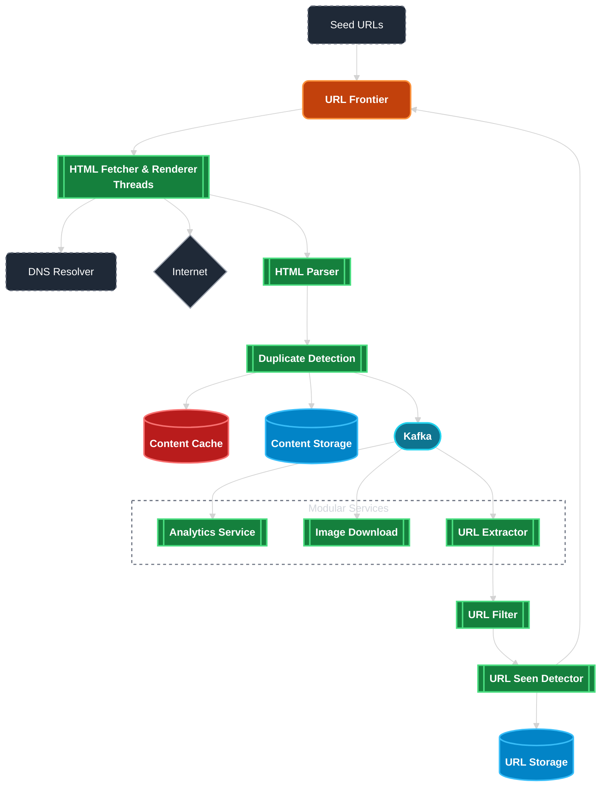
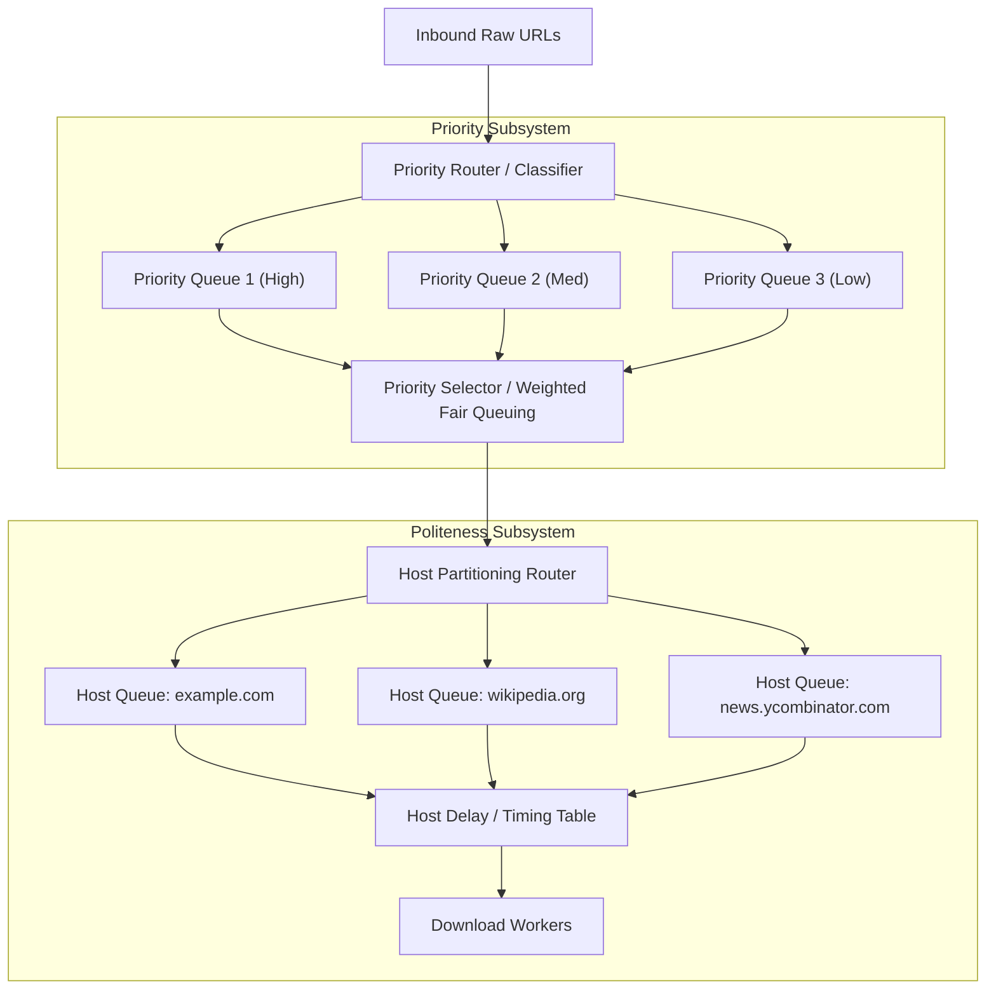

# Web Crawler System Design

A comprehensive system design guide for building a scalable, distributed web crawler, covering functional and non-functional requirements, scale estimations, detailed high-level architecture, URL frontier design (politeness vs. priority), content deduplication, and fault tolerance.

---

## 1. Requirements

### 1.1 Functional Requirements
1. **URL Crawling & Traversal:** Given a list of seed URLs, download web pages, parse text/HTML content, extract all embedded links (URLs), and recursively crawl downstream pages.
2. **Page Storage & Indexing:** Store parsed text/HTML and relevant metadata for downstream indexing (e.g., search engine inverted index, data analytics).
3. **URL & Content Deduplication:** Ensure identical URLs and duplicated page contents are not downloaded or indexed repeatedly.
4. **Politeness (Robots.txt & Rate Limiting):** Respect `robots.txt` specifications and ensure individual web servers are not overwhelmed with concurrent requests from our crawler.
5. **Freshness & Scheduling:** Support periodic re-crawling of dynamic websites based on content change frequencies.

### 1.2 Non-Functional Requirements
1. **Scalability:** Scale horizontally across worker nodes to handle billions of web pages per month.
2. **Robustness & Fault Tolerance:** Handle malformed HTML, unresponsive servers, infinite redirection loops, "spider traps", and network crashes gracefully without blocking the pipeline.
3. **High Throughput:** Download and parse pages at multi-gigabit bandwidth speeds while minimizing latency.
4. **Extensibility:** Support custom parsers and extractors for new document formats (PDFs, images, dynamic single-page applications) without redesigning the crawl engine.

---

## 2. Capacity & Scale Estimations

Let us establish realistic production numbers typical for a mid-to-large search engine crawler:

* **Target Volume:** $1\text{ billion}$ web pages per month ($\approx 30\text{ days}$).
* **Average Page Size:** $500\text{ KB}$ (HTML content, compressed payload, and extracted text).
* **Storage Retention:** $5\text{ years}$.

### 2.1 Throughput Calculations
* **Crawl Throughput (Pages per Second):**
  $$\text{Throughput} = \frac{1{,}000{,}000{,}000 \text{ pages}}{30 \times 86{,}400 \text{ seconds}} \approx 386 \text{ pages/sec}$$
* **Peak Throughput (2x buffer):**
  $$\text{Peak Throughput} \approx 2 \times 386 \approx 772 \text{ pages/sec}$$
* **Network Bandwidth Consumption:**
  $$\text{Bandwidth} = 386 \text{ pages/sec} \times 500\text{ KB} \approx 193\text{ MB/sec} \approx 1.54\text{ Gbps}$$

### 2.2 Storage Estimations
* **Monthly Page Storage:**
  $$1\text{ billion pages} \times 500\text{ KB} = 500\text{ TB/month}$$
* **5-Year Page Storage:**
  $$500\text{ TB/month} \times 12 \times 5 = 30\text{ PB}$$
* **Metadata & URL Storage:**
  * Average URL length: $\approx 100\text{ bytes}$
  * Average links per page: $100$ links $\rightarrow 100\text{ billion}$ unique URLs discovered over time
  * URL repository size: $100\text{ billion} \times 100\text{ bytes} \approx 10\text{ TB}$ (uncompressed)

---

## 3. High-Level Architecture

The end-to-end web crawler pipeline operates as an asynchronous, distributed event loop orchestrated by a URL Frontier, Fetchers, Parsers, Deduplicators, Kafka event stream, Modular Services, and persistent Storage layers.

### Component Breakdown

1. **Seed URLs:** Curated, authoritative entry points (e.g., Wikipedia, popular directories, top domain lists) injected to bootstrap the crawl.
2. **URL Frontier:** The central component holding pending URLs to download. Prioritizes URLs and strictly manages crawling politeness per domain host.
3. **HTML Fetcher & Renderer Threads:** Multi-threaded/asynchronous workers resolving DNS, querying the Internet, downloading HTML, and rendering dynamic client-side JavaScript.
4. **DNS Resolver & Internet:** In-memory DNS cache resolving domain hostnames to IP addresses without redundant network queries before dispatching requests to external web servers.
5. **HTML Parser:** Validates markup, cleans boilerplate scripts/styling, and prepares structured text content for indexing and link extraction.
6. **Duplicate Detection (SimHash):** Computes locality-sensitive 64-bit fingerprints to identify and discard near-duplicate pages without comparing raw content.
7. **Content Cache & Storage:** Fast in-memory cache and persistent distributed blob storage (e.g., S3/GCS) retaining raw HTML and parsed document text.
8. **Kafka Event Stream:** Decouples crawl ingestion from downstream consumer services, enabling scalable, asynchronous processing.
9. **Modular Services:** Pluggable consumers subscribed to Kafka topics:
   - **Analytics Service:** Tracks crawl velocity, host response times, status codes, and latency metrics.
   - **Image Download:** Asynchronously extracts and downloads media assets (images, videos).
   - **URL Extractor:** Extracts all raw hyperlinks (`<a href="...">`) embedded within the page.
10. **URL Filter:** Standardizes URLs (stripping tracking query parameters, fragments, converting to lowercase) and discards invalid or blocked extensions.
11. **URL Seen Detector (Bloom Filter):** Space-efficient probabilistic filter verifying whether each discovered URL has already been visited or queued.
12. **URL Storage:** Persistent database holding crawled and pending URL states, serving as backup to the in-memory Bloom filter.

---

## 4. Deep Dive: URL Frontier (Politeness & Priority)

The URL Frontier must solve two competing objectives:
* **Politeness:** Never overwhelm a single host with rapid concurrent requests.
* **Priority:** Prioritize high-quality, frequently changing, or authoritative web pages (e.g., PageRank or domain rank) over low-value pages.

### 4.1 Priority Subsystem
* URLs are assigned a priority score based on PageRank, domain authority, crawl history, and update frequency.
* Incoming URLs enter categorized FIFO priority queues.
* The **Priority Selector** uses weighted fair-queuing (e.g., pulling $70\%$ from Priority 1, $20\%$ from Priority 2, $10\%$ from Priority 3).

### 4.2 Politeness Subsystem
* **Host Mapping:** Each unique domain name is mapped to a dedicated FIFO queue (`Host Queue`).
* **Host Delay Table:** Tracks when the last request was dispatched to each host and calculates the next permissible request timestamp (e.g., enforcing an interval $\ge 500\text{ ms}$).
* **Worker Execution:** A worker thread pulls the next URL only when the respective host queue delay window has elapsed.

---

## 5. Deduplication Pipeline

### 5.1 URL Deduplication
* With billions of discovered links, checking an on-disk database on every URL leads to an I/O bottleneck.
* **Bloom Filter:** An in-memory, space-efficient probabilistic data structure.
  * **False Positives:** Might report an unseen URL as "already visited" (tunable, e.g., $\le 0.1\%$).
  * **False Negatives:** Impossible (never claims a visited URL is new).
* **Storage:** For 1 billion URLs with a $0.1\%$ error rate, a Bloom Filter requires $\approx 1.8\text{ GB}$ of RAM, fitting comfortably within a single caching node or distributed across Redis instances.

### 5.2 Content Deduplication (SimHash)
* Many distinct URLs serve identical or nearly identical content (mirrors, dynamic query variations, boilerplate footers).
* Cryptographic hashes (MD5, SHA-256) are too sensitive: changing a single whitespace character produces a completely different hash.
* **Locality-Sensitive Hashing (SimHash):**
  * Documents with similar text produce 64-bit fingerprint hashes with small **Hamming distances** (differing in $\le 3$ bits).
  * Fingerprints are indexed using inverted hash tables to quickly detect near-duplicate pages without comparing raw text.

---

## 6. Detailed System Flow

```mermaid
%%{init: {'theme':'dark', 'themeVariables': { 'fontSize': '15px', 'fontFamily': 'inter, sans-serif'}}}%%
flowchart LR
    %% Data Stores and External Services
    SeedURLs[("Seed URLs")]:::datastore
    URLFrontier[["URL Frontier"]]:::orange
    DNSResolver[("DNS Resolver")]:::datastore
    Internet{"Internet"}:::internet
    ContentCache[("Content Cache")]:::datastore
    ContentStorage[("Content Storage")]:::datastore
    URLStorage[("URL Storage")]:::datastore

    %% Compute Nodes
    subgraph HTML_Threads ["HTML Fetcher & Renderer Pool"]
        direction TB
        HTMLFetcher[["HTML Fetcher & Renderer Threads"]]:::green
    end

    HTMLParser[["HTML Parser"]]:::green
    DuplicateDetection[["Duplicate Detection"]]:::green
    Kafka(["Kafka Event Stream"]):::cyan

    %% Modular Downstream Services
    subgraph Modular_Services ["Modular Downstream Services"]
        direction TB
        Analytics[["Analytics Service"]]:::green
        ImageDownload[["Media / Image Downloader"]]:::green
        URLExtractor[["URL Extractor"]]:::green
    end

    %% URL Filtering and Deduplication
    URLFilter[["URL Filter"]]:::green
    URLSeenDetector[["URL Seen Detector"]]:::green

    %% Data Flow Connections
    SeedURLs -->|"1. Ingest Seeds"| URLFrontier
    URLFrontier -->|"2. Dispatch Polite URL"| HTML_Threads
    HTMLFetcher <-->|"3a. Resolve IP"| DNSResolver
    HTMLFetcher <-->|"3b. HTTP GET"| Internet
    HTMLFetcher -->|"4. Raw HTML"| HTMLParser

    HTMLParser -->|"5. Check SimHash"| DuplicateDetection
    DuplicateDetection -.->|"Cache"| ContentCache
    DuplicateDetection -.->|"Persist"| ContentStorage

    DuplicateDetection -->|"6. Publish Unique"| Kafka
    Kafka --> Analytics
    Kafka --> ImageDownload
    Kafka --> URLExtractor

    URLExtractor -->|"7. Extracted URLs"| URLFilter
    URLFilter -->|"8a. Filtered URLs"| URLSeenDetector
    URLSeenDetector -.->|"Index Seen"| URLStorage
    URLSeenDetector ==>|"8b. Loop Unseen URLs"| URLFrontier

    %% Styling Classes
    classDef datastore fill:#2D3E50,stroke:#8B95A1,stroke-width:1.5px,color:white,rx:5,ry:5,stroke-dasharray: 5 5;
    classDef internet fill:#1F2937,stroke:#6B7280,stroke-width:1.5px,color:white;
    classDef green fill:#166534,stroke:#A3E635,stroke-width:2px,color:white,rx:8,ry:8,font-weight:bold;
    classDef orange fill:#C2410C,stroke:#FB923C,stroke-width:2px,color:white,rx:8,ry:8,font-weight:bold;
    classDef cyan fill:#155E75,stroke:#22D3EE,stroke-width:2px,color:white,rx:15,ry:15,font-weight:bold;
```

### Step-by-Step Workflow Walkthrough

1. **Seed URLs Injection**
   - The crawl pipeline bootstraps by loading a curated set of authoritative seed URLs (e.g., top domains, open directory registries, authoritative news hubs) directly into the **URL Frontier**.

2. **URL Selection & Politeness Scheduling**
   - The **URL Frontier** prioritizes pending URLs (based on domain authority, PageRank, and refresh frequency) and schedules them according to host-level politeness policies (`robots.txt` rate limits and host delay timers).
   - URLs eligible for crawling are dequeued and dispatched to the **HTML Fetcher & Renderer Threads**.

3. **DNS Resolution & Content Fetching**
   - The fetcher threads query the **DNS Resolver & Cache** to translate hostnames to IP addresses without incurring redundant network round-trips.
   - The fetcher validates host permissions against cached `robots.txt` rules and performs an HTTP/HTTPS `GET` request to retrieve web pages over the **Internet** (rendering dynamic client-side JavaScript when needed).

4. **HTML Parsing & Normalization**
   - The downloaded raw HTML payload is handed off to the **HTML Parser**, which validates page markup, extracts structured readable text, strips boilerplate scripts/styling, and prepares the document for downstream consumers.

5. **Duplicate Detection & Content Persistence**
   - The parsed page is analyzed by the **Duplicate Detection** engine using Locality-Sensitive Hashing (**SimHash**).
   - If near-identical content already exists in the system, the duplicate payload is discarded to conserve resources.
   - If the content is unique, its document body and metadata are stored in the fast **Content Cache** and persisted to distributed **Content Storage** (e.g., S3/GCS or distributed blob storage).

6. **Decoupled Event Streaming via Kafka**
   - Valid, unique documents are published to a distributed message bus (**Kafka**), asynchronously fanning out to modular downstream processors:
     - **Analytics Service:** Monitors crawling metrics, response codes, latency, and throughput health.
     - **Media / Image Downloader:** Asynchronously extracts and downloads media assets (images, videos, documents).
     - **URL Extractor:** Extracts all embedded raw hyperlinks (`<a href="...">`) from the parsed content.

7. **URL Filtering & Normalization**
   - Newly discovered candidate URLs pass through the **URL Filter**, which canonicalizes URLs (lowercasing hosts, removing fragment anchors `#`, stripping tracking parameters) and discards invalid links or blacklisted file extensions (e.g., `.exe`, `.zip`, `.mp4`).

8. **Seen URL Deduplication & Frontier Feedback Loop**
   - Filtered links are checked by the **URL Seen Detector** against an in-memory **Bloom Filter** (backed by persistent **URL Storage**) to verify whether each URL has been previously crawled or queued.
   - Newly discovered, unseen URLs are streamed back into the **URL Frontier** (the feedback loop), enabling the crawler to recursively explore the web at scale.

---

## 7. Fault Tolerance & Edge Cases

### 7.1 Spider Traps
* **Problem:** Websites that dynamically generate infinite nested directory paths (e.g., `/calendar/2026/09/20/next...` or circular query loops).
* **Mitigation:**
  * Enforce a maximum URL path depth (e.g., max 15 subdirectories).
  * Restrict URL length (e.g., maximum 2,048 characters).
  * Monitor domain distribution; cap total pages crawled per host in a single cycle.

### 7.2 Robots.txt Compliance
* Download and cache `robots.txt` per host before sending requests.
* Refresh cache with an explicit TTL (e.g., 24 hours).
* Obey explicit `Crawl-delay` directives when present.

### 7.3 State Checkpointing & Worker Failures
* Fetcher workers operate in stateless configurations pulling jobs with timeouts from the Frontier.
* If a worker crashes mid-download, the message broker re-delivers the URL job to another worker.
* Periodically checkpoint Bloom Filter state and Frontier queue offsets to persistent distributed storage to survive cluster reboots.